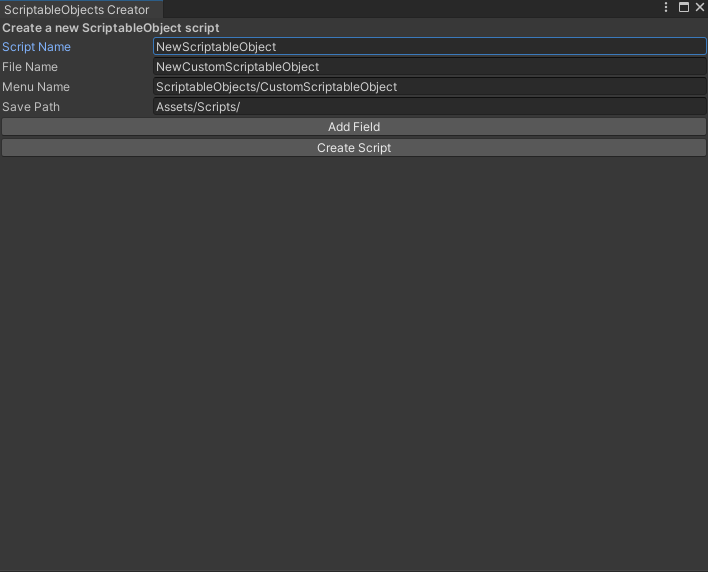
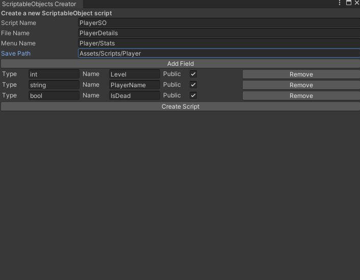
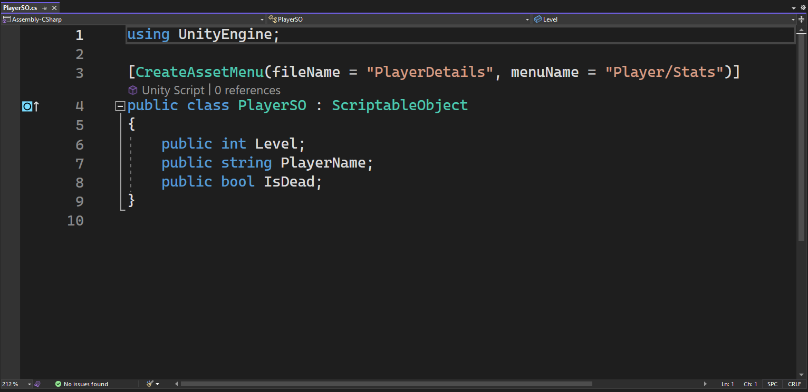
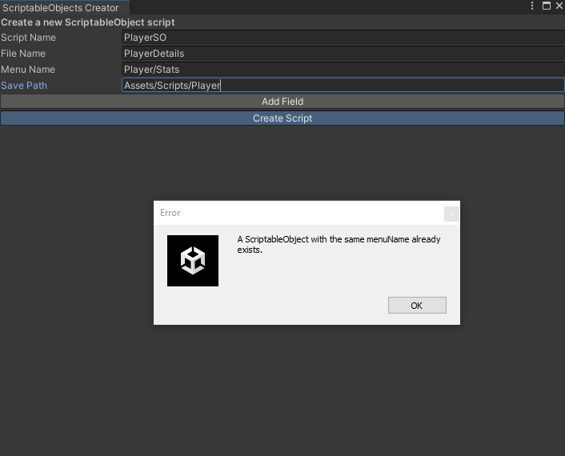

### ScriptableObjectsCreator Window Editor Tool

## Description
ScriptableObjectsCreatorWindow is a Unity Editor tool designed to streamline the creation of ScriptableObject scripts.
It allows for quick generation of customizable scripts that inherit from `ScriptableObject`, enhancing the asset creation process within Unity.

## Features
- Easy-to-use Unity Editor window interface.
- Dynamically create scripts for ScriptableObjects with customizable fields.
- Set properties like `fileName`, `menuName`, and `scriptName` directly from the Editor.
- Add custom fields (of various types) to your ScriptableObject.

## Installation
To install ScriptableObjectsCreatorWindow, follow these steps:
1. Copy the `ScriptableObjectsCreatorWindow` script into the `Assets` directory of your Unity project.
2. Make sure it's placed within an `Editor` folder to ensure correct compilation.

## Usage
After copying the script, follow these steps to use the tool:
1. In Unity, navigate to `Tools > ScriptableObjects Creator` to open the tool window.
2. Enter the desired settings for your new ScriptableObject (script name, file name, menu name).
3. Add the fields you want in your ScriptableObject (type, name, access level).
4. Click `Create Script` to generate your new ScriptableObject script.

## Example 
# Tool Preview
Here's how the ScriptableObjectsCreatorWindow looks in the Unity Editor:

# Filling in variables as needed
Here's how the it might look when you fill up the spaces:

# Script Creation
Here's the resulted script:

# Duplicate Error
To prevent the accidental overriding of existing scripts, the tool includes a duplicate check feature.

## Contributing
Contributions to the ScriptableObjectsCreatorWindow are welcome. If you have suggestions or improvements, feel free to fork this repository and submit a pull request.
